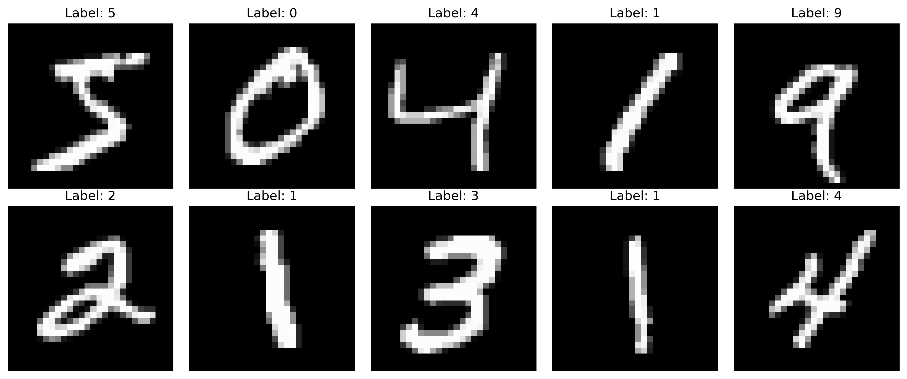

# Tugas Besar 1 IF3270 - Feedforward Neural Network

## Description 📝

This project is an implementation of a specific type of Neural Network, the Feedforward Neural Network (FFNN), built from scratch. It uses the OpenML MNIST_784 dataset for testing, with a sample size of 50,000. The dataset consists of digit images ranging from 0 to 9, each with a 28x28 resolution. The FFNN is designed to predict the digit displayed in the given images.  

  

We have implemented the core functionalities of an FFNN, including forward propagation, backward propagation, and the weight update process. The model supports training with a specified number of epochs and training data. Additionally, we have implemented various loss functions and activation functions, which can be configured for each layer in the FFNN. The project also includes initializers, regularizers, and normalizers to enhance FFNN performance.  

| Activation Functions  | Loss Functions          | Initialization Methods  | Regularizers | Normalizer   |
|----------------------|--------------------------|-------------------------|--------------|--------------|
| Linear              | Mean Square Error (MSE)   | Zero Initializer        |L1 Regularizer|RMS Normalizer|
| ReLU                | Binary Cross Entropy      | Uniform Initializer     |L2 Regularizer|              |
| Sigmoid             | Categorical Cross Entropy | Normal Initializer      |              |              |
| Tanh                |                           | Xavier Initializer      |              |              |
| Softmax             |                           | He Initializer          |              |              |

In the /notebooks directory, we provide a Jupyter notebook showcasing the full experiment and results with different parameter settings. The notebook includes training loss plots, validation loss plots, weight distributions, and gradient distributions across variations to help determine the optimal parameter values. The parameters explored in this project include:  
- Depth and Width of network  
- Activation Functions
- Learning Rate  
- Weight Initializer  
- Regularization method  
- Using normalization or not

We also then compare the results of our FFNN and the model from scikit-learn library.   

## Requirements 🤔

- **Python**: [Install Python](https://python.org/dl/)
- **Python Libraries**  
Run this command to install all the necessary libraries that  
```cmd
pip install -r requirement.txt
```  

## Setting Up 💻

### Clone the Repository

```cmd
git clone https://github.com/Gryphuss/Tubes_ML.git
cd Tubes_ML
```

## Running the Application 🏃‍♂️‍➡️

1. Go to the ffnn_experiments.ipynb. You can create new cells and begin to use our model from scratch, or you can run the cells we provided. Click 'Run All' to run all the cells from the beginning   
2. To create new cells and use the model, you can follow this example of creating using our FFNN.  
   ```python
    # Initialize the FFNN model
    model = FFNN(
        layer_sizes=layer_sizes,
        activations=['relu', 'relu', 'relu', 'softmax'], # Sequentially for each layer from the first hidden layer
        loss='categorical_cross_entropy',
        weight_initializer='xavier',
        use_rms_norm=True # or false
    )

    # Train the model using the fit method
    history = model.fit(
        X_train, 
        y_train_one_hot,
        batch_size=batch_size,
        learning_rate=learning_rate,
        epochs=epochs,
        verbose=1,
        validation_data=(X_test, y_test_one_hot)
    )

    # Make predictions
    predictions = model.predict(X)

3. If you would like to load an existing model that has been trained, run this command in a cell  
   ```python
   loaded_model = FFNN.load(filepath)
   ```  
   or if you would like to save an existing model that you have trained, run this command in a cell  
   ```python
    # Adjust the path
    MODELS_DIR = os.path.abspath("../tests")
    if not os.path.exists(MODELS_DIR):
        os.makedirs(MODELS_DIR)
    filepath = os.path.join(MODELS_DIR, "comparison" + ".pkl")
    custom_model.save(filepath)
   ```

## Assignments

**13522029 Ignatius Jhon Hezkiel Chan - FFNN class, forward, backward, Softmax, Document**<br>
**13522093 Daniel Mulia Putra Manurung - Setup, Activation, Loss, Initializer class, Document**<br>
**13522093 Matthew Vladimir Hutabarat - Regularizer, RMSNorm, Save,Load, Plot, Document**<br>